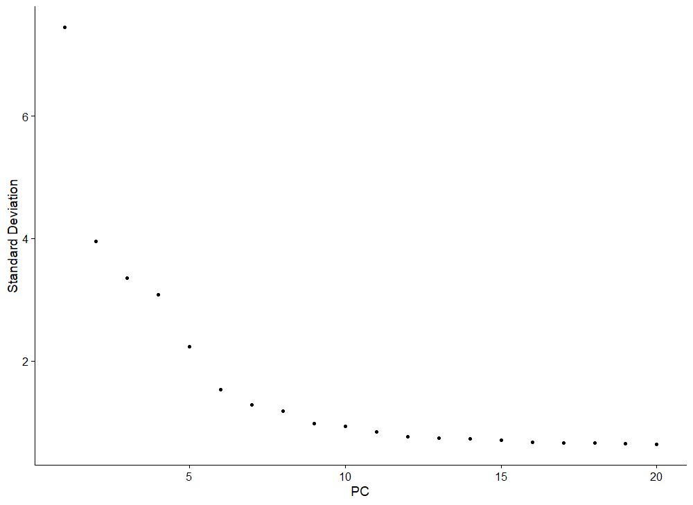
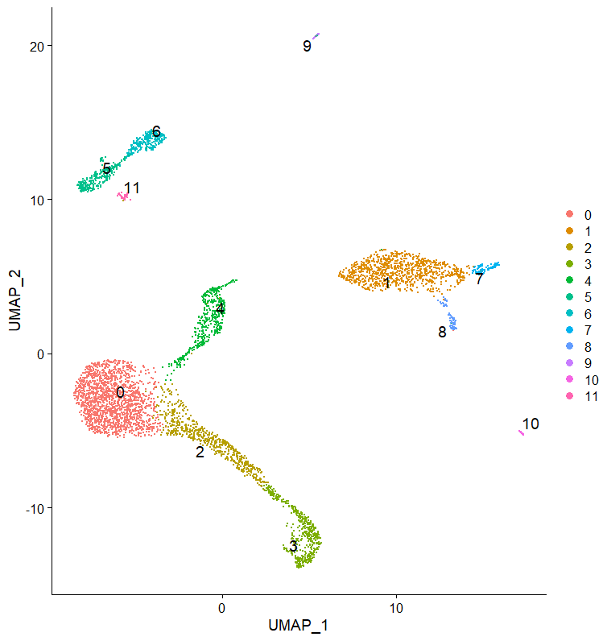
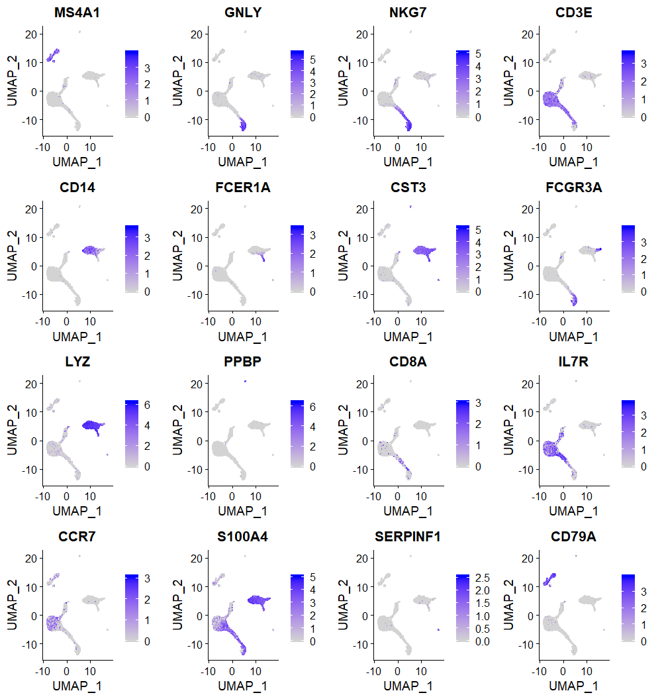
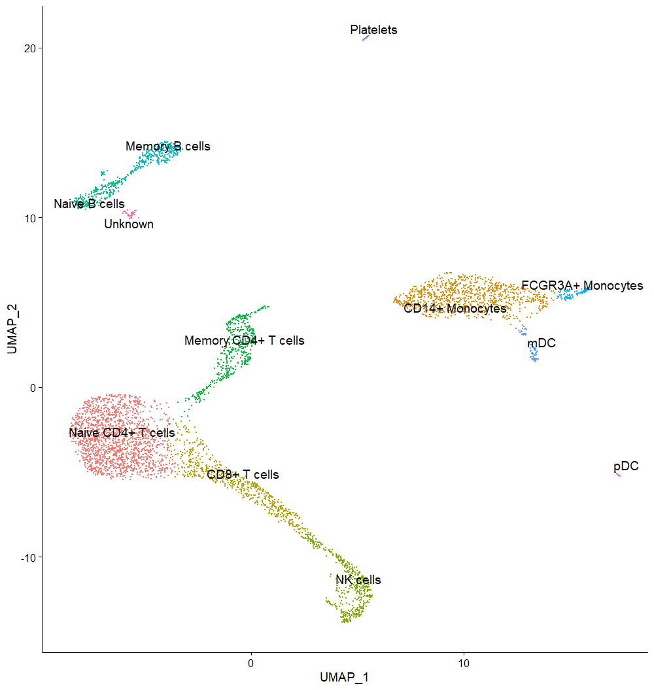

# DUBStepR
DUBStepR (Determining the Underlying Basis using Step-wise Regression) is a feature selection algorithm for cell type identification in single-cell RNA-sequencing data.


## Release Notes
Version 1.0 released on 10 December 2019.

## Setting Up DUBStepR

### Installing DUBStepR

DUBStepR requires your R version to be >= 3.5.0. Once you've ensured that, you can install DUBStepR from GitHub using the following commands:

```R
install.packages("devtools")
devtools::install_github("bbbranjan/DUBStepR")
```

### Loading DUBStepR into your environment

After installation, load DUBStepR using the following command:

```R
library(DUBStepR)
```

## Using DUBStepR

For users new to single-cell RNA sequencing data analysis, we recommend using DUBStepR with the [Seurat](https://satijalab.org/seurat/) (Satija, R. et al. Nature Biotechnol. 33.5(2015):495.) package to analyze single-cell RNA seq data. Below is a tutorial using the Seurat package.

### Install and load Seurat

Seurat can be installed and loaded into your R environment using the following commands:

```R
install.packages("Seurat")
library(Seurat)
library(dplyr)
```

### Prepare Seurat object

Here, we use a publicly available PBMC dataset generated by 10X Genomics. Here's a [link](https://support.10xgenomics.com/single-cell-gene-expression/datasets/3.0.2/5k_pbmc_v3) to the dataset. We use the **Feature / cell matrix HDF5 (filtered)** file.

Locate the file in your working directory and load the data in to your Seurat object in the following manner:

```R
seuratObj <- CreateSeuratObject(counts = Read10X_h5("5k_pbmc_v3_filtered_feature_bc_matrix.h5"), assay = "RNA", project = "10k_PBMC")
seuratObj
```
```
An object of class Seurat 
33538 features across 5025 samples within 1 assay 
Active assay: RNA (33538 features)
```

For DUBStepR, we recommend log-normalizing your 10X data. That can be performed in Seurat using the following command:

```R
seuratObj <- NormalizeData(object = seuratObj, normalization.method = "LogNormalize")
```


### Run DUBStepR to identify feature genes

DUBStepR can be inserted into the Seurat workflow at this stage, and we recommend that be done in the following manner:

```R
dubstepR.out <- DUBStepR(input.data = seuratObj@assays$RNA@data, min.cells = 0.01*ncol(seuratObj), optimise.features = T, k = 10, num.pcs = 15, error = 0)
seuratObj@assays$RNA@var.features <- dubstepR.out$optimal.feature.genes
```
```
[1] "Expression Filtering - Done"
[1] "Mitochondrial, Ribosomal and Pseudo Genes Filtering - Done"
[1] "kNN Smoothing - Done"
---> Splitting data matrix: 9 splits of 11769x1204 size
---> Splitting data matrix: 1 split of 11769x1211 size
[1] "Running Stepwise Regression"
|=============================================================================================================================| 100%[1] "Determining optimal feature set"
|=============================================================================================================================| 100%
```


### Visualize and cluster cells

Following Seurat's recommendations, we scale the gene expression data and run Principal Component Analysis (PCA). We then visualize the standard deviation of PCs using an elbow plot and select the number of PCs we think is sufficient to explain the variance in the dataset.

```R
seuratObj <- ScaleData(seuratObj, features = rownames(seuratObj))
seuratObj <- RunPCA(seuratObj, features = VariableFeatures(object = seuratObj))
ElbowPlot(seuratObj)
```



We select 10 PCs for clustering, and visualize the cells in a 2D UMAP.

```
seuratObj <- FindNeighbors(seuratObj, reduction = "pca", dims = 1:10)
seuratObj <- FindClusters(seuratObj, resolution = 0.4)
seuratObj <- RunUMAP(seuratObj, dims = 1:10, n.components = 2, seed.use = 2019)
DimPlot(seuratObj, reduction = "umap", label = TRUE, pt.size = 0.5, repel = T, label.size = 5)
```



We select the first few feature genes selected by DUBStepR to show cell type specific expression
```R
FeaturePlot(seuratObj, features = VariableFeatures(object = seuratObj)[1:16], cols = c("lightgrey", "magenta"))
```


Using known marker genes, we show cell type specific regions of the UMAP
```R
FeaturePlot(seuratObj, features = c("MS4A1", "GNLY", "NKG7", "CD3E", "CD14", "FCER1A", "CST3", "FCGR3A", "LYZ", "PPBP", "CD8A", "IL7R", "CCR7", "S100A4", "SERPINF1", "CD79A"))
```



Annotating clusters using gene expression

```R
cell.types <- c("Naive CD4+ T cells", "CD14+ Monocytes", "CD8+ T cells", "NK cells", "Memory CD4+ T cells", "Naive B cells", "Memory B cells", "FCGR3A+ Monocytes", "mDC", "Platelets", "pDC", "Unknown")
names(cell.types) <- levels(seuratObj)
seuratObj <- RenameIdents(seuratObj, cell.types)
DimPlot(seuratObj, reduction = "umap", label = TRUE, pt.size = 0.5, repel = T, label.size = 5) + NoLegend()
```



